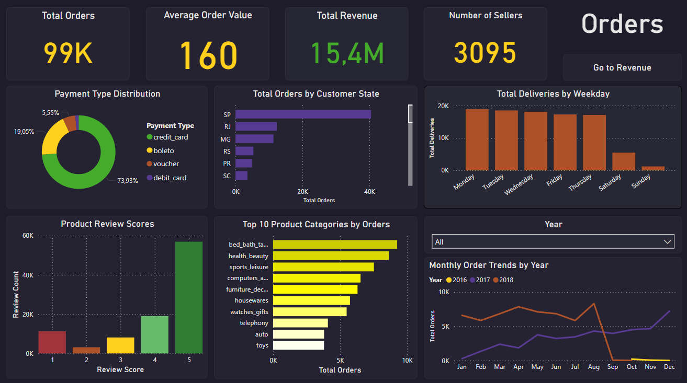
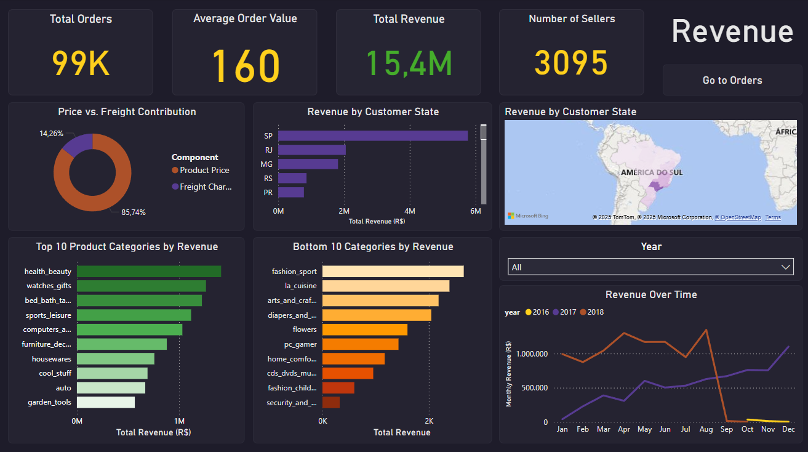

# Olist Ecommerce Analysis

---

## Overview

Using raw transaction data from Olist's marketplace, this project focuses on the **order and revenue funnels**, visualizing customer flow, payment behavior, category performance, and regional trends.  
The dashboard allows users to switch between an **Orders View** and a **Revenue View** using interactive page navigation.

---

## Dataset

- Source: [Marketing Funnel Olist – Kaggle](https://www.kaggle.com/datasets/olistbr/marketing-funnel-olist)
- Contains order status, payment info, review scores, customer states, product categories, and pricing.
- Only **delivered orders with a valid delivery date** were used for final analysis.

---

## Tools Used

- **SQL (PostgreSQL)** – Data cleaning, filtering, and transformation
- **Power BI** – Visual dashboard creation and interactive slicing

---

## Key Insights

**Order volume increased sharply from 2017 to 2018, but late-2018 data is incomplete**  
Order counts rose from just 283 in January 2017 to over 6,500 in January 2018, reflecting strong platform growth. However, there's a significant drop in September and October 2018, likely caused by incomplete or cutoff data rather than an actual decline in business performance.

**Revenue is highly concentrated in the Southeast region of Brazil**  
São Paulo alone generated over R$5.7 million in revenue, nearly three times more than any other state. Together, São Paulo, Rio de Janeiro, and Minas Gerais accounted for more than 60% of total revenue, while northern states contributed minimal amounts. This highlights a strong regional imbalance in demand and delivery reach.

**Three product categories drive nearly a quarter of total revenue**  
Health & Beauty, Watches & Gifts, and Bed, Bath & Table together represent approximately 23% of all revenue. These categories stand out as key contributors and may be strategic areas for investment or promotion.

**Credit cards are the dominant payment method**  
Approximately 74% of all transactions were completed using credit cards. Boleto accounted for 19%, while vouchers and debit cards together made up less than 7%, suggesting untapped opportunities in alternative payment strategies.

**Customer satisfaction is generally high, but low ratings still stand out**  
Around 66% of customer reviews are 5-star ratings, indicating a largely positive experience. However, over 11,000 reviews received only 1 star, pointing to possible gaps in product quality or fulfillment that could be improved.

---

## Dashboards

This project includes two interactive dashboards built in Power BI:

### Orders View
Focuses on order volume, customer behavior, review scores, and top-performing product categories.

### Revenue View
Highlights revenue trends, regional sales, top and bottom categories by revenue contribution.

You can explore both dashboards by opening the `olist_ecommerce_dashboard.pbix` file included in this repository.  
All individual charts and visual elements used in the dashboards are also available in the [`/visuals`](visuals/) folder.

---

## Recommendations

Based on the analysis, several strategic opportunities emerge for the Olist platform:

- Expand regional coverage by improving logistics and marketing efforts in the North and Northeast, where demand is currently low.
- Focus on high-performing product categories such as Health & Beauty and Watches & Gifts for promotions and bundling strategies.
- Introduce incentives for customers to use underutilized payment methods like vouchers and debit cards.
- Address pain points reflected in low review scores by improving seller vetting and delivery experience.
- Consider excluding September–October 2018 from time-based KPIs due to clear data inconsistencies.

---

## Conclusion

This project highlights strong growth in both orders and revenue between 2017 and 2018, with clear regional and category-based patterns. Despite a few limitations in the raw dataset, the findings provide actionable insights into customer behavior, payment preferences, and product performance.

The interactive dashboards built in Power BI allow for easy exploration of these patterns and can support future business decisions related to sales, logistics, and marketing strategy.

Thank you for checking out my project!

